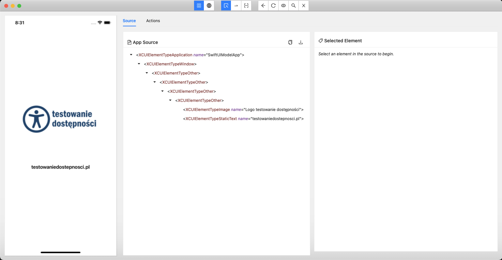
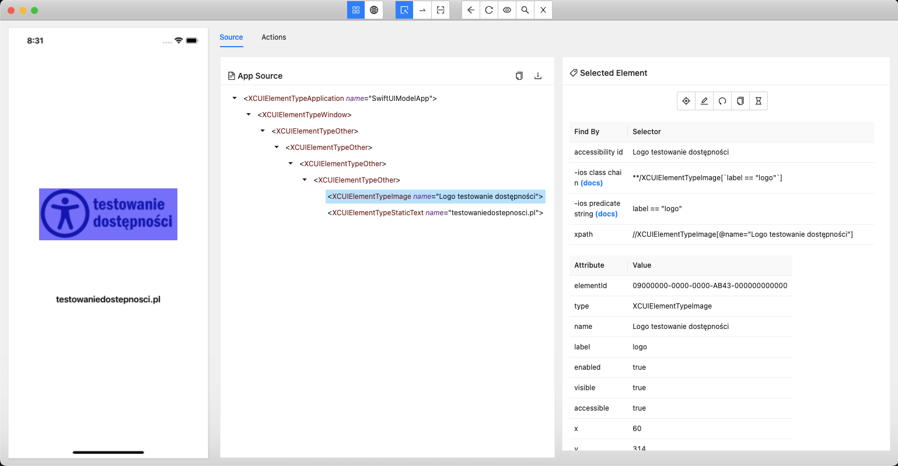

# Information about the LogoApp

This app is very light. It contains only the logo and text from the blog testingdostepnosci.pl. This app was created to represent a DOM object from an iOS app for one of the blog entries.





```
<?xml version="1.0" encoding="UTF-8"?>
<AppiumAUT>
  <XCUIElementTypeApplication type="XCUIElementTypeApplication" name="SwiftUIModelApp" label="SwiftUIModelApp" enabled="true" visible="true" accessible="false" x="0" y="0" width="390" height="844" index="0">
    <XCUIElementTypeWindow type="XCUIElementTypeWindow" enabled="true" visible="true" accessible="false" x="0" y="0" width="390" height="844" index="0">
      <XCUIElementTypeOther type="XCUIElementTypeOther" enabled="true" visible="true" accessible="false" x="0" y="0" width="390" height="844" index="0">
        <XCUIElementTypeOther type="XCUIElementTypeOther" enabled="true" visible="true" accessible="false" x="0" y="0" width="390" height="844" index="0">
          <XCUIElementTypeOther type="XCUIElementTypeOther" enabled="true" visible="true" accessible="false" x="0" y="0" width="390" height="844" index="0">
            <XCUIElementTypeOther type="XCUIElementTypeOther" enabled="true" visible="false" accessible="false" x="0" y="0" width="390" height="844" index="0">
              <XCUIElementTypeImage type="XCUIElementTypeImage" name="Logo testowanie dostępności" label="logo" enabled="true" visible="true" accessible="true" x="60" y="314" width="270" height="101" index="0"/>
              <XCUIElementTypeStaticText type="XCUIElementTypeStaticText" value="testowaniedostepnosci.pl" name="testowaniedostepnosci.pl" label="testowaniedostepnosci.pl" enabled="true" visible="true" accessible="true" x="92" y="522" width="206" height="21" index="1"/>
            </XCUIElementTypeOther>
          </XCUIElementTypeOther>
        </XCUIElementTypeOther>
      </XCUIElementTypeOther>
    </XCUIElementTypeWindow>
  </XCUIElementTypeApplication>
</AppiumAUT>
```
